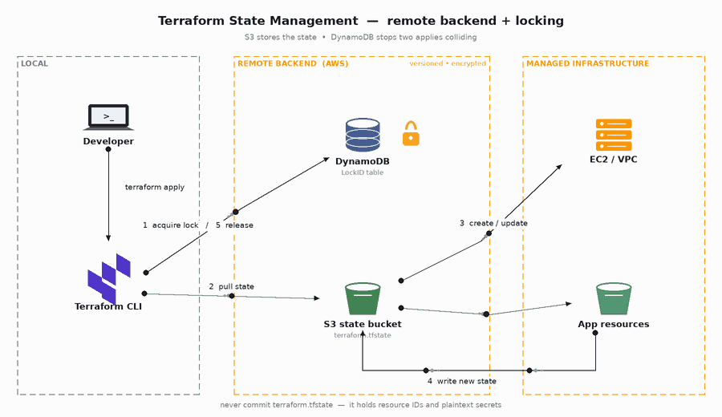
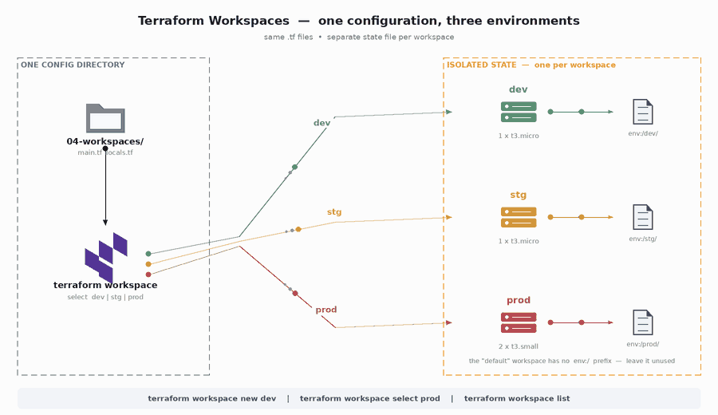
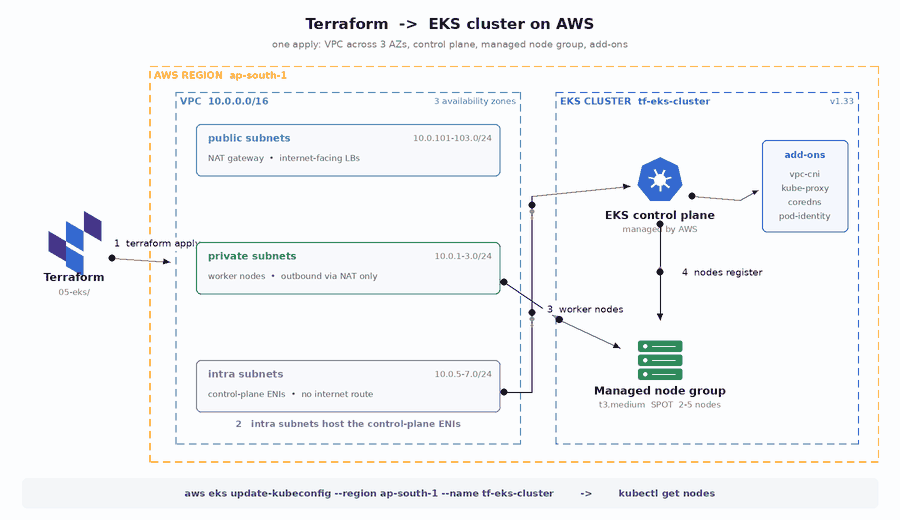

# Terraform: from first resource to a production-shaped EKS cluster

A hands-on Terraform repo built while working through a full AWS + Terraform course. Every folder is a self-contained, runnable stack with its own README, ordered so each one depends only on what came before.

```bash
git clone https://github.com/Ibrahim-Naseef/Terraform.git
cd Terraform
./scripts/install_terraform.sh
export AWS_PROFILE=your-profile
```

---

## Layout

| Folder | Topic | Needs AWS? |
|---|---|:---:|
| [`01-basics/01-first-resource`](01-basics/01-first-resource) | init → plan → apply → destroy with a local file | no |
| [`01-basics/02-ec2-keypair-sg`](01-basics/02-ec2-keypair-sg) | Key pair, security group, EC2 with `for_each` | yes |
| [`01-basics/03-variables-outputs-locals`](01-basics/03-variables-outputs-locals) | Types, locals, `for` expressions, validation | no |
| [`02-state-management/01-backend-bootstrap`](02-state-management/01-backend-bootstrap) | S3 state bucket + DynamoDB lock table | yes |
| [`02-state-management/02-app-with-remote-state`](02-state-management/02-app-with-remote-state) | A stack that actually uses the backend | yes |
| [`03-modules`](03-modules) | Custom `s3` and `ec2` modules + a root that calls them | yes |
| [`04-workspaces`](04-workspaces) | One config, three environments (`dev`/`stg`/`prod`) | yes |
| [`05-eks`](05-eks) | VPC + EKS 1.33 + managed node group | yes 💸 |
| [`06-examples`](06-examples) | `count` vs `for_each`, `lifecycle`, `moved`, `check`, `terraform test` | no |

Shared material lives in [`docs/`](docs) — longer write-ups on [state](docs/02-state-management.md), [modules](docs/03-modules.md), [workspaces](docs/04-workspaces.md) and [EKS](docs/05-eks.md).

---

## Suggested path

```
01-basics/01  →  learn the loop, nothing can break
01-basics/02  →  first real AWS resources
01-basics/03  →  the expression language, free to experiment
02-state      →  stop keeping state on your laptop
03-modules    →  stop copy-pasting resource blocks
04-workspaces →  stop copy-pasting entire folders
05-eks        →  put all of it together
06-examples   →  the features that prevent accidental destruction
```

---

## Visual walkthroughs

| | |
|---|---|
| **Remote state & locking** |  |
| **Workspaces: dev / stg / prod** |  |
| **EKS cluster provisioning** |  |

---

## Conventions used throughout

- **One stack per directory.** Each has its own `terraform.tf`, `providers.tf`, `variables.tf`, `outputs.tf` and `README.md`.
- **Pinned versions.** `required_version` and provider constraints in every root; registry modules always carry an explicit `version`.
- **No provider blocks inside modules.** Modules inherit providers from their caller.
- **No state in Git.** `*.tfstate` is gitignored and the previously committed state files were removed during the restructure.
- **No credentials or keys in Git.** `*.pem` and `terra-key*` are gitignored; generate your own with `scripts/generate_keypair.sh`.
- **Secure defaults.** Encrypted EBS and S3, IMDSv2 required, public access blocked, TLS-only bucket policies.
- **Documented inputs.** Every variable has a `description` and a `type`; constrained ones have a `validation` block.

## Convenience targets

```bash
make fmt                                   # terraform fmt -recursive
make validate DIR=05-eks                   # init -backend=false && validate
make plan DIR=04-workspaces
make clean                                 # nuke .terraform dirs
```

CI runs `fmt -check`, `init -backend=false`, `validate` on every stack plus a `tfsec` scan — see [`.github/workflows/terraform-ci.yml`](.github/workflows/terraform-ci.yml).

## Cost

Everything outside `05-eks` fits comfortably in the AWS free tier if you `terraform destroy` afterwards. `05-eks` does not: an idle cluster is roughly $110/month once the control plane and NAT gateway are counted. Destroy it the same day.
